# Ani-Quiz

A fun quiz for anime/manga lovers! Ani-Quiz is a fun and exciting quiz with mixed questions from some of the most well known animes/mangas.
The purpose of this quiz is to test the knowledge and skills of the user regarding anime and manga. 

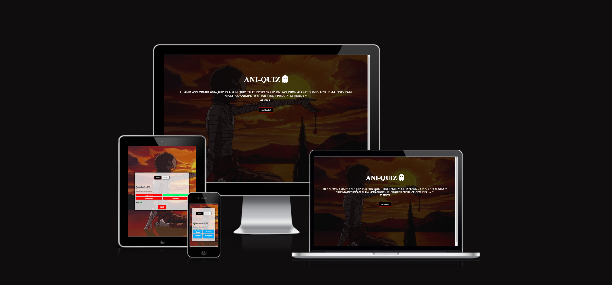

## Features 

### Existing Features

- __Main Page__

  - Main page has a text that describes what the user will experience on this website and also a button wih the text "I'm Ready!" with the intention of taking the user to the quiz page as soon as they click that button.

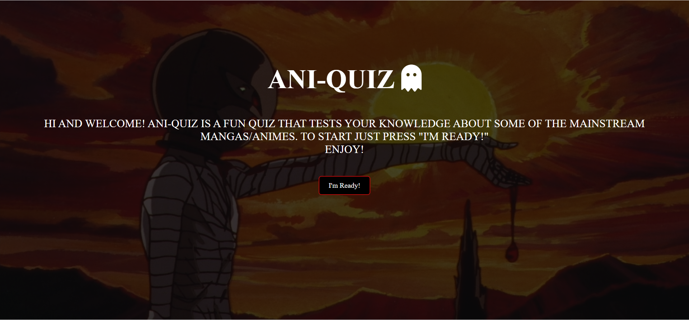

- __Quiz Page__

  - This page has the quiz and some features that will provide the user with some questions and alternatives. After starting the quiz via the "start" button, another button appears which is called "restart". The function of this button is to give the user the option of restarting the game if they either put the wrong answer or if they just want a fresh start.
  - It also includes a true/false function that pops up everytime the user answers the questions.
  - And lastly the "next" button, which as it's name implies, goes straight to the next question

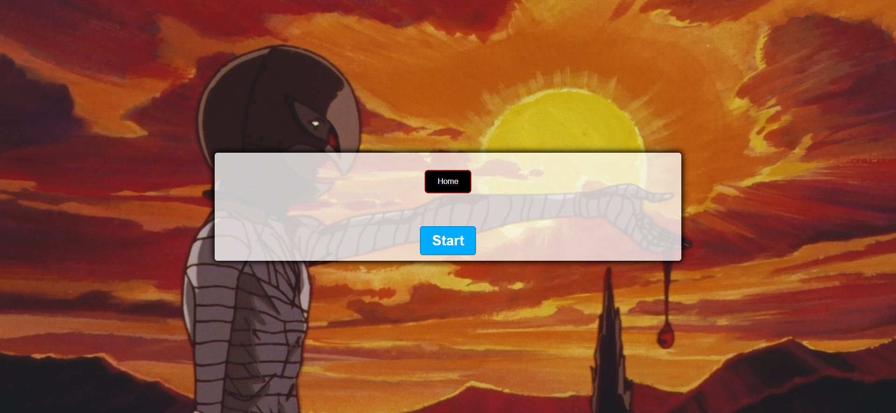
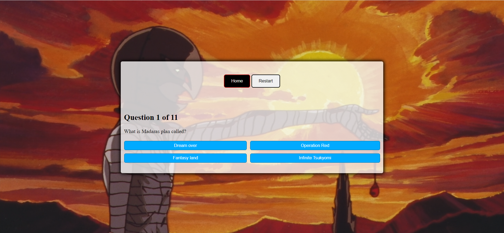
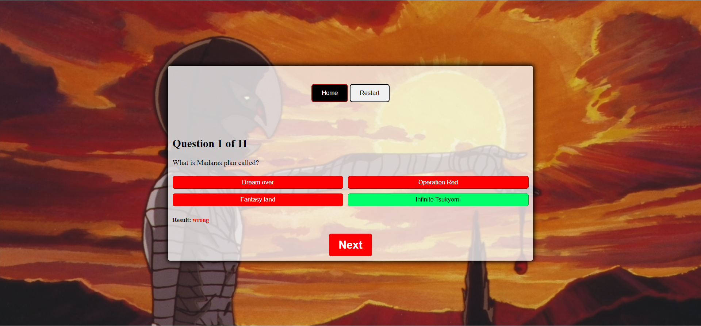

### Features left to implement

Due to lack of time, a small detail which would make the quiz a bit more interactive was not a priority.

- Add more hover effects to the alternative buttons to make the page a bit more interesting for the user.

## Testing 

### Performance

Lighthouse was used to test the perfomance, the screenshots show how the site performs on desktop and mobile.

#### Desktop 

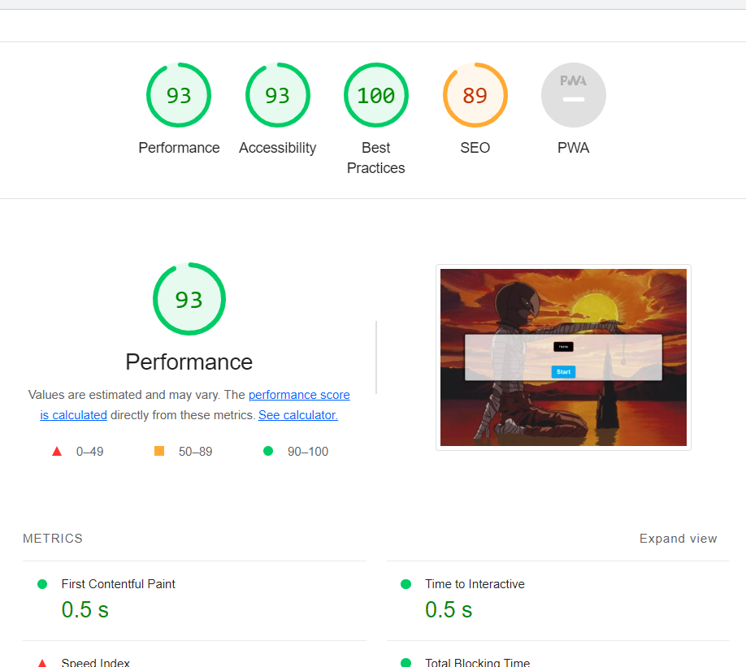

#### Mobile

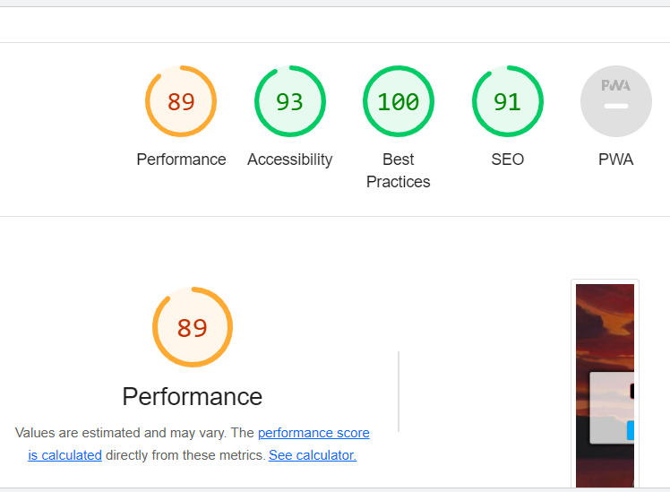

### Validator Testing 

For this project I used the W3C Validator for the HTML & CSS, and for the Javascript I used Jshint.
Down below I have listed screenshots for every test.

- HTML
  - No errors were returned when passing through the official W3C Validator 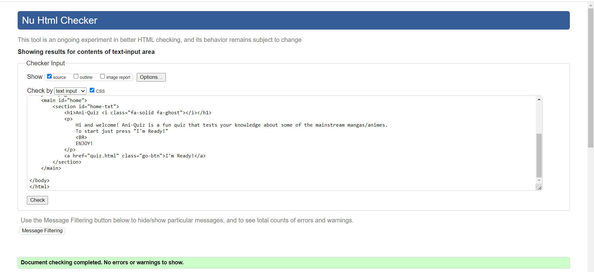
  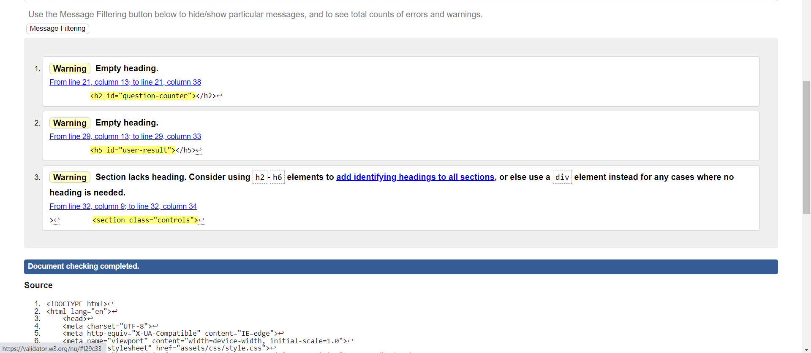

- CSS
  - No errors were found when passing through the official W3C Validator 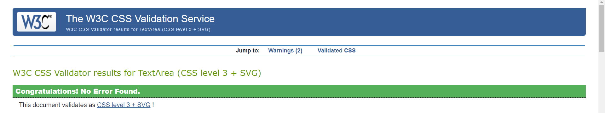

- Javascript
  - No errors were found when passing through the Jshint 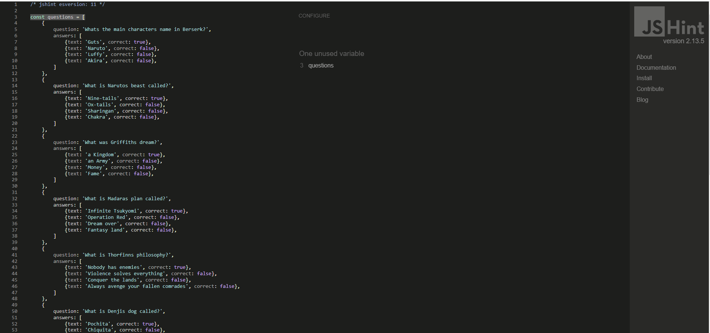 
  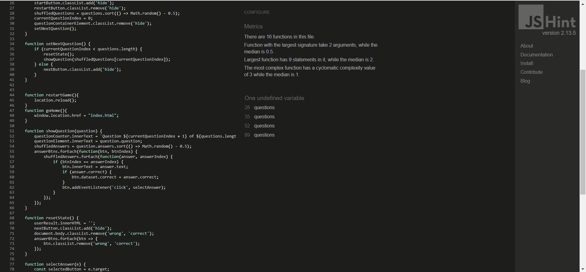 
  
  ### Other testing
  To measure how responsive the website was I decided to try it out on:
  - Google Chrome
  - Microsoft Edge (screenshot of live site below)
  

  Different devices was also used to inspect wether or not the website is responsive for smaller devices than pc, 
  such as tablets or mobile devices.

  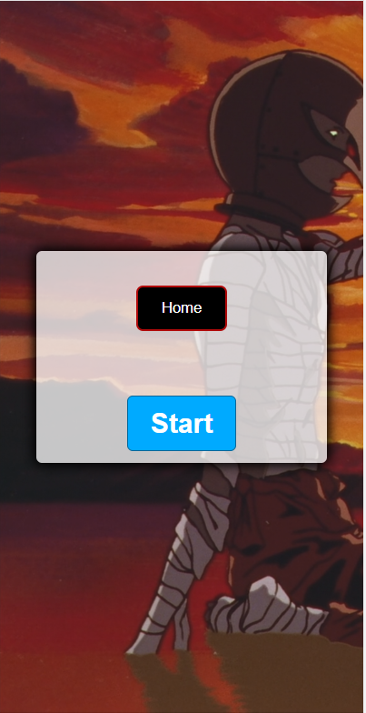

### Unfixed Bugs

There are no unfixed bugs that I am aware of

## Deployment

The site was deployed to GitHub pages. The steps to deploy are as follows: 
  - In the [GitHub repository](https://github.com/SanZangana/Ani-Quiz), navigate to the Settings tab 
  - From the source section drop-down menu, select the **Main** Branch, then click "Save".
  - The page will be automatically refreshed with a detailed ribbon display to indicate the successful deployment.

The live link can be found on [GitHub Pages](https://sanzangana.github.io/Ani-Quiz/)

### Local Deployment

In order to make a local copy of this project, you can clone it. In your IDE Terminal, type the following command to clone my repository:

- `git clone https://github.com/SanZangana/Ani-Quiz.git`

Alternatively, if using Gitpod, you can click below to create your own workspace using this repository.

## Credits 

### Coding

- For this project I used the knowledge & skills that I acquired from the modules.
- I would also like to acknowledge the help from my CI mentor, Tim Nelson!
- The inspiration for this quiz was taken from this youtube tutorial (https://www.youtube.com/watch?v=riDzcEQbX6k) 

### Content 

- The icons in the footer were taken from [Font Awesome](https://fontawesome.com/)

### Media

- The photos used on the home and quiz page were from [Reddit](https://www.reddit.com/r/Berserk/comments/360p4p/its_called_behelit_the_egg_of_the_king_he_who/)

